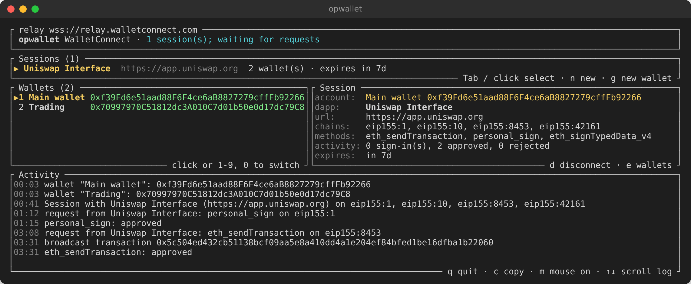

# opwallet

A terminal Ethereum wallet whose seed phrase lives only in
**1Password**. Connect it to any dapp over WalletConnect, and approve every
signature from an interactive dashboard in your terminal.



## Features

* **Seed phrase stored in 1Password.** Wallets are native 1Password *Crypto
  Wallet* items. The phrase is fetched only when something has to be signed,
  kept in locked, zeroed memory, and never written to disk, argv, env vars or
  logs. Each read needs Touch ID (or your system's equivalent) again.
* **Simple simulations with Tenderly.** Every transaction approval includes a
  link that opens the exact transaction in Tenderly's simulator, so you can
  see the outcome, token transfers and a full trace before you answer `y`.
* **WalletConnect v2.**
  * **Several dapps at once.** Connect as many dapps as you like, each with
    its own wallets and active account.
  * **Persistent sessions.** Connections are saved and resume the next time
    you run `opwallet`, with no need to pair again.
  * **Switch wallets.** Connect several wallets to a dapp, switch the active
    account with one key, and add or remove wallets without reconnecting.
  * **Origin verification.** WalletConnect Verify warns about mismatches and
    known scam domains.
* **Interactive UI or CLI.** A full-screen dashboard for day-to-day use,
  plus plain commands for creating, listing, verifying and signing, and for
  scripts.

## Disclaimers

* **This project was 100% vibecoded with [Claude](https://claude.com/claude-code).**
  Every line was written by an AI. It has not been professionally audited.
  Read the code and decide for yourself whether to trust it.
* **Storing seed phrases in 1Password is at your own risk.** Anyone who gets
  into your 1Password account, or into an unlocked 1Password app on your
  machine, gets your funds. A password manager is a hot, online store, not
  cold storage.
* **Keep larger balances elsewhere.** Use a hardware wallet, or use opwallet
  as one signer of a multi-sig (for example a [Safe](https://safe.global))
  alongside hardware signers, so a compromise of 1Password or of this tool
  alone cannot move funds.

## Quick start

```sh
# 1. Install the 1Password CLI and enable
#    Settings → Developer → Integrate with 1Password CLI in the desktop app.
#    https://developer.1password.com/docs/cli/get-started/
brew install 1password-cli        # macOS; see the docs for other platforms

# 2. Install opwallet
cargo install --path .
opwallet doctor                   # checks that op is installed and signed in

# 3. Get a free WalletConnect project ID from https://cloud.reown.com
export OPWALLET_PROJECT_ID=...

# 4. Open the dashboard
opwallet
```

In the dapp, choose *WalletConnect* and *copy link*. In the dashboard, press
`n`, paste the `wc:` URI, pick your wallets, and approve the session. If you
don't have a wallet yet, press `g` to generate one in 1Password.

## The dashboard

Run `opwallet` with no arguments to open the dashboard. It resumes every
saved session and lists them at the top. The Wallets and Session panels
show the selected session, and the activity log is at the bottom.

| Key                | Action                                                               |
|--------------------|----------------------------------------------------------------------|
| `n`                | connect another dapp: paste its `wc:` URI and tick wallets           |
| `Tab` / `←` `→`    | select another session (or click it)                                 |
| `1`-`9`, `0`       | make that wallet the session's active account (or click it)          |
| `e`                | add or remove wallets on the selected session                        |
| `g`                | generate a new wallet in 1Password, optionally add it to the session |
| `d`                | disconnect the selected session (the dapp is told)                   |
| `c`                | copy menu: recent transaction hashes, signed transactions, addresses |
| `m`                | toggle mouse capture (off lets you select text with the terminal)    |
| `↑` `↓`            | scroll the activity log                                              |
| `q` / `Ctrl-C`     | quit; sessions stay saved and resume next time                       |

### Approving requests

Every request a dapp sends opens a pop-up that starts with the dapp's name
and must be answered `y` or `n`. Use the arrow keys to scroll long messages.

* `personal_sign` / `eth_sign`: the message text or bytes.
* `eth_signTypedData(_v4)`: the domain, primary type, message and digest.
* `eth_signTransaction` / `eth_sendTransaction`: chain, recipient, value,
  calldata selector, gas, fees, nonce and maximum cost. Missing fields
  (nonce, gas limit, EIP-1559 fees) are filled in from the chain.
* Sign-In with Ethereum (one-click auth): after you approve the connection,
  each sign-in request is shown with its domain, URI, chains and the full
  EIP-4361 message. Each one needs its own `y`. A warning appears when the
  sign-in domain does not match the dapp's URL.

**Origin verification.** A dapp's name and URL are whatever the dapp claims.
WalletConnect Verify gives a second opinion. The dapp's page registers each
message with the Verify server, which records the page's origin. Connection
prompts and every signing prompt start with what it found:

* `origin: https://app.example (WalletConnect Verify agrees; not proof)`:
  the recorded origin matches the dapp's URL.
* `WARNING: origin mismatch`: Verify recorded a different site than the
  dapp claims to be.
* `DANGER: ... known scam` (and a `SCAM WARNING:` title): Verify flags the
  origin as malicious. Answer `n`.
* `origin: unknown`: Verify had no record, for example because the dapp
  does not use it, runs outside a browser, or the server could not be
  reached.

A match is not proof. The origin is only as trustworthy as the browser that
reported it. A scripted or server-side browser, or any client that is not a
real browser, can register a message under whatever origin it likes. A
mismatch or a scam flag is worth taking seriously; a match only means
nothing looked wrong.

Connecting to a dapp with a mismatched or scam origin takes a second
confirmation (`Really connect to ...?`) after the usual one.

Both ways of resolving it are supported. v3 attestations are signed JWTs
that the relay attaches to the message, checked against the Verify
server's P-256 key. v1/v2 records are looked up by message hash. The result
only informs the prompt; nothing is approved or rejected automatically. The
lookups send only message hashes to the Verify server, and signing requests
that are answered without a prompt skip them. Use `--no-verify` to turn it
off.

### Simulating with Tenderly

Transaction approvals include a link on the bottom row of the dialog that
opens the transaction, exactly as it will be signed, pre-filled in
[Tenderly](https://tenderly.co)'s web simulator. Click the link or press `o`
to open it in your browser, or press `c` to copy it. Run the simulation, then
come back and answer `y` or `n`.

opwallet sends nothing to Tenderly and needs no API key. You only need to be
signed in to Tenderly in your browser. The link opens in your default
Tenderly project; to use another one, pass `--tenderly-project ACCOUNT/PROJECT`
or set `OPWALLET_TENDERLY_PROJECT`. Both names are in the project's dashboard
URL (`https://dashboard.tenderly.co/ACCOUNT/PROJECT/...`), and that URL can
also be passed as is. Contract deployments get no link, because
the simulator needs a target address.

### Multiple dapps and wallets

You can connect any number of dapps at once. Each session has its own set of
wallets and its own active account. Every address is offered on every chain
that session approved.

With several wallets connected, one is the **active account**. Dapps list it
first, and requests that don't name an account go to it. To switch, press the
wallet's number or click its row. The dapp is sent an `accountsChanged`
event, the same signal browser wallets send, and updates right away. Adding or
removing wallets with `e` sends a `wc_sessionUpdate` followed by
`accountsChanged`. A session always keeps at least one wallet.

`g` creates a 12-word wallet at the default derivation path, the same as
`opwallet create --name <name>`. Use the command for 24 words or another
path. The new item is read back from 1Password and verified before it is
used. **opwallet never deletes wallets.** Removing a wallet from a session
only stops offering it to that dapp. To delete a wallet, delete its item in
the 1Password app.

### Saved sessions

Settled sessions are saved and resumed the next time you run `opwallet`, so
dapps stay connected across restarts. While opwallet is not running, the
relay holds a dapp's requests for up to five minutes. Sessions last seven
days and are extended automatically once a day while opwallet runs. Expired
sessions are dropped.

They are stored in `sessions.json` in the state directory:
`~/.local/state/opwallet` (or `$XDG_STATE_HOME/opwallet`), or
`~/Library/Application Support/opwallet` on macOS. Override the location with
`--state-dir` or `OPWALLET_STATE_DIR`. The file holds each session's
symmetric key, its pairing key, the dapp's metadata, the connected wallet
names and addresses, and the relay client identity. It never holds anything
derived from a seed phrase. Someone who can read it could read your
dapps' requests and answer them in your wallet's name, but could not sign
anything, because every signature still needs the phrase from 1Password and
your approval. The file is written `0600` inside a `0700` directory and
replaced atomically. The directory is locked while opwallet is serving the
sessions, so two copies never answer the same dapp.

## Command line

The dashboard covers everyday use. These commands handle wallet management
and one-off tasks, and work in scripts:

```sh
opwallet                              # dashboard (see above)
opwallet doctor                       # is op installed and signed in?

# Wallets
opwallet create --name "Main wallet"  # 12 words, m/44'/60'/0'/0/0
opwallet create --name "Cold" --words 24 --path "m/44'/60'/0'/0/1"
opwallet list                         # names, addresses, item IDs, vaults
opwallet address --name "Main wallet" # prints the address after verifying it
opwallet verify  --name "Main wallet" # exit 0 only if phrase ⇔ address
opwallet sign    --name "Main wallet" --message "hello"      # EIP-191
opwallet sign    --name "Main wallet" --message 0xdeadbeef   # raw bytes

# WalletConnect
opwallet connect                      # dashboard, starting with a new connection
opwallet connect --name "Main wallet" --name "Cold" "wc:7f6e...@2?relay-protocol=irn&symKey=..."
opwallet sessions                     # list saved sessions
opwallet disconnect uniswap           # end one (by number, dapp name/URL or topic)
opwallet disconnect --all
```

`create` refuses to reuse an existing item title, never prints the phrase
unless you pass `--reveal`, and reads the item back from 1Password to confirm
the round trip before reporting success.

`connect` takes the `wc:` URI as an argument or at a prompt (quotes are
stripped either way). Pass `--name` once per wallet (`--name a --name b`, or
`--name a,b`) to skip the wallet picker.

**Options**

| Option                              | Environment                   | Purpose                                              |
|-------------------------------------|-------------------------------|------------------------------------------------------|
| `--project-id <id>`                 | `OPWALLET_PROJECT_ID`         | WalletConnect project ID                             |
| `--vault <name\|id>`                | `OPWALLET_VAULT`              | 1Password vault to use                               |
| `--name <name>`                     | `OPWALLET_NAME`               | wallet to use                                        |
| `--op-bin <path>`                   | `OPWALLET_OP_BIN`             | path to the `op` binary                              |
| `--no-relock`                       | `OPWALLET_NO_RELOCK=1`        | don't run `op signout` after each phrase read        |
| `--plain`                           |                               | line-based prompts instead of the dashboard          |
| `--rpc <chain>=<url>`               |                               | your own JSON-RPC endpoint (repeatable)              |
| `--tenderly-project <acct/project>` | `OPWALLET_TENDERLY_PROJECT`   | Tenderly project for simulator links                 |
| `--relay-url <url>`                 | `OPWALLET_RELAY_URL`          | a different WalletConnect relay                      |
| `--verify-url <url>`                | `OPWALLET_VERIFY_URL`         | a different WalletConnect Verify server              |
| `--no-verify`                       | `OPWALLET_NO_VERIFY=true`     | skip WalletConnect Verify origin checks              |
| `--state-dir <dir>`                 | `OPWALLET_STATE_DIR`          | where saved sessions are kept                        |

**Plain mode.** When stdin or stdout is not a terminal, or with `--plain`,
the same flows run as line-based prompts. `opwallet` then serves the saved
sessions and exits when none are left, and `opwallet connect` does the same
after pairing the new dapp.

**Chain access.** Missing transaction fields are filled in over JSON-RPC.
By default this uses the WalletConnect blockchain API with your project ID.
Pass `--rpc 1=https://my.node` to use your own endpoints.

**Touch ID on every read.** After each read of a seed phrase, opwallet
runs `op signout`, so the 1Password desktop app has to authorize the CLI
again (Touch ID / Windows Hello / system auth) before the next read.
Otherwise the app keeps the CLI authorized until it locks. Pass `--no-relock`
to keep the CLI session, for example when you signed in with `op signin` and
a password instead of the app integration.

## How it talks to 1Password

`opwallet` shells out to the official 1Password CLI, `op`. With
**Settings → Developer → Integrate with 1Password CLI** enabled in the
desktop app, `op` authenticates through the running app (Touch ID / Windows
Hello / system auth) and needs no tokens or passwords on disk. This is the
only supported way to reach the local app, because the 1Password SDKs accept
only service-account tokens and talk to 1Password's servers directly. Service
accounts also work here (`op` honors `OP_SERVICE_ACCOUNT_TOKEN`), which is
useful for CI.

Wallet items use the built-in Crypto Wallet category:

| Field             | Content                                           |
|-------------------|---------------------------------------------------|
| `recovery phrase` | BIP-39 mnemonic (concealed)                       |
| `wallet address`  | EIP-55 checksummed address                        |
| `derivation path` | BIP-32 path the address was derived at (custom)   |
| tags              | `opwallet`                                        |

1Password labels the seed phrase field `recovery phrase`; opwallet uses that
built-in field as is.

## Security model

The seed phrase is the only long-lived secret. The goal is for it to
exist in this process's memory for as short a time as possible, in as few
places as possible, and for none of those places to leak.

**Where the phrase can be**

* In 1Password (the source of truth).
* In the `op` process while it encrypts or decrypts the item.
* In `opwallet`, only inside a `SecretBuf`: a dedicated anonymous `mmap`
  region that is `mlock`ed (never swapped), `MADV_DONTDUMP` (never in a
  core dump), and zeroed with volatile writes before it is unmapped, cleared
  or grown. Everything `op` prints is read directly into such a buffer, the
  phrase is deserialized by *borrowing* from it (no heap copy), and it is
  wiped as soon as the key has been derived. `create` drops its own copy
  before reading the item back for verification.

**What never happens**

* The phrase is never passed on the command line (visible in `ps`, shell
  history and audit logs). Item JSON goes to `op` over stdin.
* It never touches environment variables, temp files, logs or the clipboard.
* It is never printed unless you explicitly pass `--reveal` (with a warning).
* It never appears in an error message: invalid phrases are reported by word
  position only. No type holding it implements `Debug`.
* `list`, the dashboard and resuming sessions only ask `op` for the public
  `wallet address` field, so browsing wallets never decrypts a phrase.

**Integrity.** Before every use, the address derived from the stored phrase
is compared with the stored `wallet address` field. If they differ (an edited
or corrupted item, a wrong derivation path), the command fails loudly and
does nothing else.

**Key derivation** is implemented in-crate (BIP-39 → PBKDF2-HMAC-SHA512 →
BIP-32 → secp256k1) rather than through a mnemonic library, because the
popular crates keep entropy, seeds and extended keys in ordinary heap memory
without zeroization. Here every intermediate value is a `SecretBuf` or a
`Zeroizing` wrapper, wordlist lookups and checksum comparisons run in
constant time, and the final key lives in a `k256` signing key that zeroizes
on drop. The implementation is checked against the BIP-39 and BIP-32
reference vectors and the well-known Hardhat mnemonic.

**Process hardening** runs before anything else. Core dumps are disabled
(`RLIMIT_CORE=0`). On Linux the process is marked non-dumpable, which also
blocks `ptrace` and `/proc/<pid>/mem` access from other non-root processes.
On macOS, `PT_DENY_ATTACH` blocks debuggers. `OPWALLET_NO_HARDEN=1` disables
this for debugging the tool itself.

**WalletConnect**

* The phrase is fetched from 1Password and the key derived **per request**,
  after you approve it, and wiped as soon as the signature is produced. The
  only secret held for the life of a session is the session's own symmetric
  key, which is needed to talk to the dapp and is what the saved-sessions
  file keeps between runs.
* Requests are rejected before you are prompted if they name an account that
  isn't connected, use a chain the session did not approve, or carry a
  `chainId` that disagrees with the session.
* `eth_sign` is treated exactly like `personal_sign` (EIP-191 prefix), so a
  dapp cannot trick you into signing a raw transaction hash.
* The relay only ever sees ChaCha20-Poly1305 ciphertext. The relay connection
  is authenticated with an Ed25519 client key that is saved with the
  sessions, so the relay sees the same client after a restart.

**Randomness.** Every secret comes from `getrandom::fill`, which reads
directly from the operating system's cryptographic RNG: `getrandom(2)` on
Linux, `getentropy` / `SecRandomCopyBytes` on macOS, and `BCryptGenRandom` on
Windows. There is no user-space PRNG and the `rand` crate is not used. A
12-word phrase uses 16 bytes (128 bits) of entropy and a 24-word phrase 32
bytes (256 bits). The same source feeds the X25519 session keys, the Ed25519
relay identity and every ChaCha20-Poly1305 nonce. secp256k1 signatures use
deterministic RFC 6979 nonces, so a weak RNG at signing time cannot leak the
key.

**Limitations**

* Root, or an attacker with your user's full privileges *and* the ability to
  bypass Yama/ptrace restrictions, can read process memory.
* The compiler may leave short-lived copies of key material in registers or
  on the stack. Those are not locked or wiped.
* serde_json copies a value onto the ordinary heap only if it contains JSON
  escape sequences, which a valid mnemonic never does. Such copies are still
  zeroized on drop.
* `mlock` counts against `RLIMIT_MEMLOCK`; the tool needs well under 1 MiB.
  If locking is impossible in your environment,
  `OPWALLET_ALLOW_UNLOCKED_MEMORY=1` turns the failure into a warning.
* Windows has no memory locking or anti-debug support yet. Secrets are still
  zeroized on drop.
* `--reveal` puts the phrase in your terminal's scrollback. Clear it
  afterwards.

## Supported WalletConnect methods

`personal_sign`, `eth_sign`, `eth_signTypedData` (v3/v4),
`eth_signTransaction`, `eth_sendTransaction`, `eth_sendRawTransaction`,
`eth_accounts`, `eth_requestAccounts`, `eth_chainId`,
`wallet_switchEthereumChain`, `wallet_addEthereumChain`, and Sign-In with
Ethereum on the session proposal. Every EVM chain the dapp asks for is
approved, with the same address on each.

Not supported: the legacy `wc_sessionAuthenticate` flow (replaced by sign-in
requests on the proposal), link mode, and non-EVM namespaces.

## Development

```sh
cargo test                      # unit + end-to-end tests (fake `op` in tests/fake-op)
cargo clippy --all-targets -- -D warnings
cargo fmt --all -- --check
```

The end-to-end tests run the real binary against a small Python stand-in for
`op` that persists items to a temp directory, so they exercise the exact JSON
sent to and parsed from 1Password. `tests/walletconnect.rs` plays both relay
and dapp over a local websocket and checks every signature the wallet
returns, including a two-wallet session driven entirely through the prompts.
